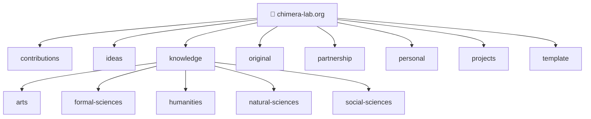
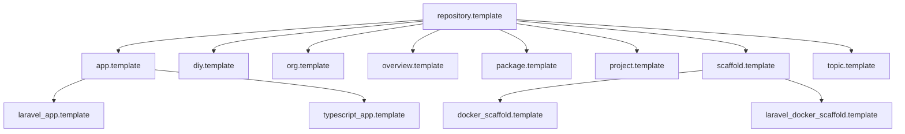

# :file_folder: <!-- <var key="org.name" applied> -->chimera-lab<!-- </var> --> — <!-- <var key="org.slogan" applied> -->Free to Experiment<!-- </var> -->

<!-- <badges name="brand" applied> -->

<!-- </badges> -->

<!-- <badges name="license,last-commit,issues,stars" layout="inline" applied> -->

   

<!-- </badges> -->

## :book: Table of Contents

- [:file_folder: <!-- <var key="org.name" applied> -->chimera-lab<!-- </var> --> — <!-- <var key="org.slogan" applied> -->Free to Experiment<!-- </var> -->](./#file_folder-var-keyorgname-applied-chimera-lab-var-var-keyorgslogan-applied-free-to-experiment-var)
  - [:telescope: Overview](./#telescope-overview)
    - [:telescope: Totals](./#telescope-totals)
      - [:telescope: By type](./#telescope-by-type)
      - [:telescope: By level](./#telescope-by-level)
    - [:telescope: Popular](./#telescope-popular)
    - [:telescope: Recently Updated](./#telescope-recently-updated)
  - [:card_file_box: Submodules](./#card_file_box-submodules)
    - [:card_file_box: contributions](./#card_file_box-contributions)
    - [:card_file_box: ideas](./#card_file_box-ideas)
    - [:card_file_box: knowledge](./#card_file_box-knowledge)
    - [:card_file_box: original](./#card_file_box-original)
    - [:card_file_box: partnership](./#card_file_box-partnership)
    - [:card_file_box: personal](./#card_file_box-personal)
    - [:card_file_box: projects](./#card_file_box-projects)
    - [:card_file_box: template](./#card_file_box-template)
  - [:building_construction: Structure](./#building_construction-structure)
    - [:building_construction: Organization Map](./#building_construction-organization-map)
    - [:building_construction: Repository Types](./#building_construction-repository-types)
    - [:building_construction: Template Inheritance](./#building_construction-template-inheritance)
  - [:toolbox: Tools](./#toolbox-tools)
    - [:toolbox: chimera-lab-cli](./#toolbox-chimera-lab-cli)
    - [:toolbox: chimera-lab-laravel](./#toolbox-chimera-lab-laravel)
    - [:toolbox: chimera-lab-vscode\_typescript](./#toolbox-chimera-lab-vscode-typescript)
    - [:toolbox: chimera-lab-web\_blade](./#toolbox-chimera-lab-web-blade)
    - [:toolbox: design-system\_blade](./#toolbox-design-system-blade)
    - [:toolbox: php-to-plantuml\_vscode](./#toolbox-php-to-plantuml-vscode)
    - [:toolbox: wordpress-plugin-abstraction](./#toolbox-wordpress-plugin-abstraction)
  - [:jigsaw: Components](./#jigsaw-components)
    - [:jigsaw: chimera-lab-archives](./#jigsaw-chimera-lab-archives)
    - [:jigsaw: chimera-lab-chat](./#jigsaw-chimera-lab-chat)
    - [:jigsaw: chimera-lab-cli-website](./#jigsaw-chimera-lab-cli-website)
    - [:jigsaw: chimera-lab-cli](./#jigsaw-chimera-lab-cli)
    - [:jigsaw: chimera-lab-compliance](./#jigsaw-chimera-lab-compliance)
    - [:jigsaw: chimera-lab-docker-stack](./#jigsaw-chimera-lab-docker-stack)
    - [:jigsaw: chimera-lab-enterprise](./#jigsaw-chimera-lab-enterprise)
    - [:jigsaw: chimera-lab-erp](./#jigsaw-chimera-lab-erp)
    - [:jigsaw: chimera-lab-infra](./#jigsaw-chimera-lab-infra)
    - [:jigsaw: chimera-lab-organization](./#jigsaw-chimera-lab-organization)
    - [:jigsaw: chimera-lab-templates](./#jigsaw-chimera-lab-templates)
    - [:jigsaw: chimera-lab-website](./#jigsaw-chimera-lab-website)
    - [:jigsaw: chimera-lab-workspace](./#jigsaw-chimera-lab-workspace)
    - [:jigsaw: chimera-lab](./#jigsaw-chimera-lab)
    - [:jigsaw: organizer](./#jigsaw-organizer)
  - [:books: References](./#books-references)

## :telescope: Overview

**chimera-lab** is built around one idea: documentation should be a living ecosystem, not a
maintenance burden. By standardizing how information is managed and shared across repositories,
every document becomes a node in a connected knowledge graph — authored once, rendered everywhere,
always in sync.

At the core is a directive system that separates data, content, and rendering. `fragment` pulls in
content from external sources. `cmr` surfaces live repository data by executing CLI commands inline.
`llm` generates contextual prose to populate docs automatically. `config`, `meta`, and `var` feed
structured data into templates at render time, giving each repository its own identity while sharing
a common foundation.

On top of that, documents and repository types carry scoped rule contracts — validation that knows
the difference between a `.project` and a `.topic`, enforcing the right structure, required
sections, and allowed directives exactly where they apply. The result is an ecosystem where
standards scale without friction.

> **New here?** See [DEVELOPMENT.md](DEVELOPMENT.md) to set up your environment and start working
> with the organization, or [CONTRIBUTING.md](CONTRIBUTING.md) for contribution guidelines.

<!-- <cmr cmd="org.pinned" applied> --><!-- </cmr> -->

<!-- <cmr cmd="org.releases[count=5]" applied> -->

*No recent releases found.*

<!-- </cmr> -->

<!-- <cmr cmd="org.summary" applied> -->

**48** repos · **13** templates · **5** types

<!-- </cmr> -->

<!-- <cmr cmd="org.stats" applied> -->

### :telescope: Totals

| Metric       | Count |
| ------------ | ----- |
| Repositories | 48    |
| Templates    | 13    |

#### :telescope: By type

| Type        | Repos |
| ----------- | ----- |
| `.project`  | 15    |
| `.topic`    | 13    |
| `.template` | 13    |
| `.package`  | 5     |
| `.app`      | 2     |

#### :telescope: By level

| Level | Count |
| ----- | ----- |
| 0     | 8     |
| 1     | 40    |

<!-- </cmr> -->

### :telescope: Popular

<!-- <cmr cmd="org.popular[count=5]" applied> -->

| Repository                                                                | Stars |
| ------------------------------------------------------------------------- | ----- |
| [template.topic](https://github.com/chimera-lab/template.topic)           | ⭐ 0   |
| [repository.template](https://github.com/chimera-lab/repository.template) | ⭐ 0   |

<!-- </cmr> -->

### :telescope: Recently Updated

<!-- <cmr cmd="org.recent[count=8]" applied> -->

| Repository                                                                | Last Push  |
| ------------------------------------------------------------------------- | ---------- |
| [template.topic](https://github.com/chimera-lab/template.topic)           | 2026-05-07 |
| [repository.template](https://github.com/chimera-lab/repository.template) | 2026-05-07 |

<!-- </cmr> -->

## :card_file_box: Submodules

<!-- <card header="topics.items.*.name" link="topics.items.*.url" context="topics.items.*.description" repo="topics.items.*.github_slug" visibility="topics.items.*.visibility" local_license="topics.items.*.local_license" local_last_commit="topics.items.*.local_last_commit" local_issues="topics.items.*.local_issues" badges="license,last-commit,issues,stars,visibility" layout="header,context,badges,link" applied> -->

<!-- <data name="topics"> -->

<!-- <cmr cmd="org.topic[output=json,depth=0,fragment=README.md#overview]" applied> --><!-- </cmr> -->

<!-- </data> -->

### :card_file_box: contributions

Community guidelines, contribution processes, and standards for the chimera-lab organization. Covers code of conduct, pull request flows, commit conventions, and the documentation practices shared across all repositories.

  

[contributions](https://github.com/chimera-lab/contributions.topic)

### :card_file_box: ideas

Proposals, concepts, and feature ideas for future chimera-lab projects. A staging ground for exploring new directions, tooling experiments, and application concepts before they graduate into dedicated project repositories.

  

[ideas](https://github.com/chimera-lab/ideas.topic)

### :card_file_box: knowledge

A structured knowledge base organized across academic disciplines — arts, formal sciences, humanities, natural sciences, and social sciences. Each sub-topic aggregates curated references, notes, and resources relevant to chimera-lab research and learning.

 

[knowledge](https://github.com/chimera-lab/knowledge.topic)

### :card_file_box: original

This topic contains the original chimera-lab applications, tools, and scaffolds. These are the foundational projects that preceded the current template-driven organization system.

 

[original](https://github.com/chimera-lab/original.topic)

### :card_file_box: partnership

Collaboration opportunities, partner integrations, and external relationships within the chimera-lab ecosystem. Tracks ongoing and potential partnerships across tools, communities, and open-source projects.

  

[partnership](https://github.com/chimera-lab/partnership.topic)

### :card_file_box: personal

Personal workspace for individual contributor resources within the chimera-lab organization. Includes schedule management, personal tracking, and private tooling used alongside the shared organization repositories.

  

[personal](https://github.com/chimera-lab/personal.topic)

### :card_file_box: projects

This topic contains all chimera-lab project repositories. Each project tracks planning, milestones, and coordination for a specific initiative within the organization.

  

[projects](https://github.com/chimera-lab/projects.topic)

### :card_file_box: template

Curated repository templates for the chimera-lab organization — covering apps, packages, scaffolds, topics, and more. Each template enforces shared structure, metadata conventions, and CMR tooling to ensure consistency across new repositories.

    

[template](https://github.com/chimera-lab/template.topic)

<!-- </card> -->

## :building_construction: Structure

### :building_construction: Organization Map

<!-- <cmr cmd="org.map" applied> -->

<!-- </cmr> -->

### :building_construction: Repository Types

<!-- <cmr cmd="org.types" applied> -->

| Suffix      | Purpose                       |
| ----------- | ----------------------------- |
| `.topic`    | Knowledge organization        |
| `.project`  | Dedicated projects            |
| `.app`      | Applications and tools        |
| `.package`  | Libraries and packages        |
| `.scaffold` | Boilerplates and generators   |
| `.template` | Repository templates          |
| `.overview` | Learning material and guides  |
| `.diy`      | DIY and hardware projects     |
| `.org`      | Organization-level repository |

<!-- </cmr> -->

### :building_construction: Template Inheritance

<!-- <cmr cmd="org.inheritance" applied> -->

<!-- </cmr> -->

## :toolbox: Tools

<!-- <card header="tools.items.*.name" link="tools.items.*.url" context="tools.items.*.description" repo="tools.items.*.github_slug" visibility="tools.items.*.visibility" local_license="tools.items.*.local_license" local_last_commit="tools.items.*.local_last_commit" local_issues="tools.items.*.local_issues" badges="license,last-commit,issues,stars,visibility" layout="header,context,badges,link" applied> -->

<!-- <data name="tools"> -->

<!-- <cmr cmd="org.tools[output=json,fragment=README.md#overview]" applied> --><!-- </cmr> -->

<!-- </data> -->

### :toolbox: chimera-lab-cli

TypeScript CLI (`cmr`) for managing chimera-lab organizations, repositories, documentation, and templates. Provides commands for rendering markdown directives, syncing submodules, managing metadata, scaffolding from templates, and interacting with GitHub — all from a single unified tool.

   

[chimera-lab-cli](https://github.com/chimera-lab/chimera-lab-cli.app)

### :toolbox: chimera-lab-laravel

Laravel package providing a design-system foundation with web components and a reactive CSS token architecture. Delivers shared UI primitives, typography, spacing, and colour tokens for chimera-lab applications built on Laravel and Blade.

   

[chimera-lab-laravel](https://github.com/chimera-lab/chimera-lab-laravel.package)

### :toolbox: chimera-lab-vscode\_typescript

VS Code extension that integrates the chimera-lab CLI (`cmr`) directly into the editor. Exposes CMR commands as VS Code actions for rendering directives, managing repository metadata, and running template operations without leaving the IDE.

  

[chimera-lab-vscode\_typescript](https://github.com/chimera-lab/chimera-lab-vscode_typescript.package)

### :toolbox: chimera-lab-web\_blade

Blade package for rendering chimera-lab markdown documents inside Laravel applications. Parses and outputs CMR-formatted markdown — including directives, fragments, and variables — as fully rendered Blade views.

  

[chimera-lab-web\_blade](https://github.com/chimera-lab/chimera-lab-web_blade.package)

### :toolbox: design-system\_blade

Design system tokens, primitives, and shared styles for chimera-lab UI packages. Defines the foundational layer of colours, spacing, typography, and component primitives consumed by Laravel/Blade packages across the chimera-lab ecosystem.

  

[design-system\_blade](https://github.com/chimera-lab/design-system_blade.package)

### :toolbox: php-to-plantuml\_vscode

VS Code extension that generates PlantUML class diagrams from PHP namespaces and source files. Analyses PHP class structures, interfaces, and inheritance hierarchies and produces corresponding `.puml` diagram output directly in the editor.

  

[php-to-plantuml\_vscode](https://github.com/chimera-lab/php-to-plantuml_vscode.app)

### :toolbox: wordpress-plugin-abstraction

PHP abstraction layer for building WordPress plugins with shared infrastructure. Provides a consistent base for plugin registration, hooks, settings pages, and service container integration — reducing boilerplate and enforcing conventions across chimera-lab WordPress projects.

  

[wordpress-plugin-abstraction](https://github.com/chimera-lab/wordpress-plugin-abstraction.package)

<!-- </card> -->

## :jigsaw: Components

<!-- <card header="projects.items.*.name" link="projects.items.*.url" context="projects.items.*.description" repo="projects.items.*.github_slug" visibility="projects.items.*.visibility" local_license="projects.items.*.local_license" local_last_commit="projects.items.*.local_last_commit" local_issues="projects.items.*.local_issues" badges="license,last-commit,issues,stars,visibility" layout="header,context,badges,link" applied> -->

<!-- <data name="projects"> -->

<!-- <cmr cmd="project.list[output=json,fragment=README.md#overview]" applied> --><!-- </cmr> -->

<!-- </data> -->

### :jigsaw: chimera-lab-archives

Archive and deprecation tracker for chimera-lab. Catalogues repositories that have been retired, renamed, or superseded — preserving historical context, migration notes, and rationale for each decision. Serves as the authoritative reference for understanding what existed before the current organization structure.

  

[chimera-lab-archives](https://github.com/chimera-lab/chimera-lab-archives.project)

### :jigsaw: chimera-lab-chat

Planning and coordination for the chimera-lab real-time communication platform. Covers architecture decisions, protocol and service selection, deployment topology, notification integration, and end-to-end encryption requirements — ensuring the chat layer integrates cleanly with the wider chimera-lab infrastructure and identity systems.

 

[chimera-lab-chat](https://github.com/chimera-lab/chimera-lab-chat.project)

### :jigsaw: chimera-lab-cli-website

Planning and coordination for the CMR CLI public documentation website. Tracks content architecture, versioned API and command reference, tutorial structure, deployment pipeline, and the publishing workflow that keeps the docs site in sync with each `cmr` release.

 

[chimera-lab-cli-website](https://github.com/chimera-lab/chimera-lab-cli-website.project)

### :jigsaw: chimera-lab-cli

Milestone and release tracker for the `cmr` CLI tool. Coordinates feature planning, version milestones, issue triage, and release notes across the chimera-lab-cli.app codebase. The source of truth for what ships in each version of the command-line toolchain.

  

[chimera-lab-cli](https://github.com/chimera-lab/chimera-lab-cli.project)

### :jigsaw: chimera-lab-compliance

Cross-repository compliance coordination for chimera-lab. Tracks licensing conformance, security policy enforcement, and regulatory obligations across all organization repositories. Consolidates open security advisories, license audits, and policy decisions into a single project for visibility and accountability.

  

[chimera-lab-compliance](https://github.com/chimera-lab/chimera-lab-compliance.project)

### :jigsaw: chimera-lab-docker-stack

Docker-based development and deployment stack for chimera-lab services. Coordinates the design and maintenance of compose configurations, service definitions, networking, and volumes used across local development environments and staging deployments. Provides a reproducible foundation for running chimera-lab applications in containers.

  

[chimera-lab-docker-stack](https://github.com/chimera-lab/chimera-lab-docker-stack.project)

### :jigsaw: chimera-lab-enterprise

Enterprise offerings and business operations planning for chimera-lab. Tracks commercial product definitions, client engagement workflows, SLA policies, and business model decisions. Bridges the open-source tooling layer with the commercial services and support structures built on top of it.

  

[chimera-lab-enterprise](https://github.com/chimera-lab/chimera-lab-enterprise.project)

### :jigsaw: chimera-lab-erp

ERP solution planning and coordination for chimera-lab, built on Frappe and ERPNext. Tracks customization requirements, module selection, deployment planning, and integration work needed to adapt the ERPNext framework to chimera-lab's internal operations — covering project management, finance, HR, and inventory workflows.

  

[chimera-lab-erp](https://github.com/chimera-lab/chimera-lab-erp.project)

### :jigsaw: chimera-lab-infra

Infrastructure planning and coordination for chimera-lab hosted services. Tracks server provisioning, networking topology, hosting provider decisions, DNS and TLS configuration, CI/CD pipeline infrastructure, and environment parity between development, staging, and production across all deployed services.

 

[chimera-lab-infra](https://github.com/chimera-lab/chimera-lab-infra.project)

### :jigsaw: chimera-lab-organization

Organization-wide governance and standards coordination for chimera-lab. Manages decisions around repository naming conventions, structural policies, contribution guidelines, and cross-repository rules. The canonical reference for how the chimera-lab GitHub organization is structured and operated.

  

[chimera-lab-organization](https://github.com/chimera-lab/chimera-lab-organization.project)

### :jigsaw: chimera-lab-templates

Template design, inheritance hierarchy, and CLI scaffolding coordination for chimera-lab. Tracks the development and maintenance of all `.template` repositories, defines the inheritance model from `repository.template` to specialised types, and aligns template evolution with the `cmr` CLI's scaffolding and sync commands.

   

[chimera-lab-templates](https://github.com/chimera-lab/chimera-lab-templates.project)

### :jigsaw: chimera-lab-website

Public-facing website for the chimera-lab organization, built on Laravel and Tailwind CSS. Tracks design decisions, content structure, deployment pipeline, and feature milestones for chimera-lab.com — covering the landing page, project showcase, blog, and documentation portal.

   

[chimera-lab-website](https://github.com/chimera-lab/chimera-lab-website.project)

### :jigsaw: chimera-lab-workspace

VS Code multi-root workspace configuration and developer tooling for chimera-lab contributors. Tracks workspace `.code-workspace` files, recommended extensions, settings, task configurations, and debug profiles that unify the local development experience across all chimera-lab repositories.

  

[chimera-lab-workspace](https://github.com/chimera-lab/chimera-lab-workspace.project)

### :jigsaw: chimera-lab

Top-level coordination project for the chimera-lab organization. Tracks the overall product vision, strategic roadmap, cross-project dependencies, and governance decisions for the chimera-lab super-repository. The single place where organization-wide milestones, priorities, and the long-term direction are planned and reviewed.

   

[chimera-lab](https://github.com/chimera-lab/chimera-lab.project)

### :jigsaw: organizer

Personal file and workspace organizer for chimera-lab contributors. Automates the sorting and cataloguing of documents, projects, and digital assets across local development environments. Provides scripts, rules, and configuration for maintaining a consistent folder structure and reducing manual file management overhead.

  

[organizer](https://github.com/chimera-lab/organizer.project)

<!-- </card> -->

## :books: References

- [:page_facing_up: CODE\_OF\_CONDUCT.md](CODE_OF_CONDUCT.md)
- [:page_facing_up: CONTRIBUTING.md](CONTRIBUTING.md)
- [:page_facing_up: SECURITY.md](SECURITY.md)
- [:page_facing_up: ./docs/STRUCTURE.md](./docs/STRUCTURE.md)
- [:page_facing_up: ./docs/ORGANIZATION.md](./docs/ORGANIZATION.md)
