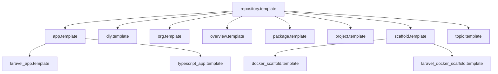

# :file_folder: <!-- <var key="org.name" applied> -->chimera-lab<!-- </var> -->

<!-- <badges name="brand" applied> -->

<!-- </badges> -->

## :book: Table of Contents

- [:file_folder: <!-- <var key="org.name" applied> -->chimera-lab<!-- </var> -->](./#file_folder-var-keyorgname-applied-chimera-lab-var)
  - [:telescope: Overview](./#telescope-overview)
    - [:telescope: Totals](./#telescope-totals)
      - [:telescope: By type](./#telescope-by-type)
      - [:telescope: By level](./#telescope-by-level)
  - [:building_construction: Structure](./#building_construction-structure)
    - [:card_file_box: Submodules](./#card_file_box-submodules)
    - [:building_construction: Repository Types](./#building_construction-repository-types)
    - [:building_construction: Template Inheritance](./#building_construction-template-inheritance)
  - [:toolbox: Tools](./#toolbox-tools)
  - [:jigsaw: Components](./#jigsaw-components)
  - [:books: References](./#books-references)

## :telescope: Overview

> <!-- <var key="org.slogan" applied> -->Experimenting...<!-- </var> -->

<!-- <cmr cmd="org.stats" applied> -->

### :telescope: Totals

| Metric       | Count |
| ------------ | ----- |
| Repositories | 48    |
| Templates    | 13    |

#### :telescope: By type

| Suffix      | Count |
| ----------- | ----- |
| `.project`  | 15    |
| `.template` | 13    |
| `.topic`    | 13    |
| `.package`  | 5     |
| `.app`      | 2     |

#### :telescope: By level

| Level | Count |
| ----- | ----- |
| 0     | 8     |
| 1     | 40    |

<!-- </cmr> -->

<!-- <cmr cmd="org.pinned" applied> --><!-- </cmr> -->

<!-- <cmr cmd="org.popular[count=5]" applied> -->

| Repository                                                                | Stars | Language | Description |
| ------------------------------------------------------------------------- | ----- | -------- | ----------- |
| [repository.template](https://github.com/chimera-lab/repository.template) | ⭐ 0   | Makefile |             |

<!-- </cmr> -->

<!-- <cmr cmd="org.recent[count=8]" applied> -->

| Repository                                                                | Language | Last Push  | Description |
| ------------------------------------------------------------------------- | -------- | ---------- | ----------- |
| [repository.template](https://github.com/chimera-lab/repository.template) | Makefile | 2026-05-07 |             |

<!-- </cmr> -->

<!-- <cmr cmd="org.releases[count=5]" applied> -->

*No recent releases found.*

<!-- </cmr> -->

## :building_construction: Structure

### :card_file_box: Submodules

<!-- <card header="topics.*.name" link="topics.*.url" layout="header|link" applied> -->

<!-- <data name="topics"> -->

<!-- <cmr cmd="org.topic[output=json]" applied> --><!-- </cmr> -->

<!-- </data> -->

*No items.*

<!-- </card> -->

### :building_construction: Repository Types

<!-- <cmr cmd="org.types" applied> -->

Repository type reference

| Suffix      | Purpose                       |
| ----------- | ----------------------------- |
| `.topic`    | Knowledge organization        |
| `.project`  | Dedicated projects            |
| `.app`      | Applications and tools        |
| `.package`  | Libraries and packages        |
| `.scaffold` | Boilerplates and generators   |
| `.template` | Repository templates          |
| `.overview` | Learning material and guides  |
| `.diy`      | DIY and hardware projects     |
| `.org`      | Organization-level repository |

<!-- </cmr> -->

### :building_construction: Template Inheritance

<!-- <cmr cmd="org.inheritance" applied> -->

<!-- </cmr> -->

## :toolbox: Tools

<!-- <cmr cmd="org.tools" applied> -->

| Tool                               | Type    | Description                                                                           | Tags                                      |
| ---------------------------------- | ------- | ------------------------------------------------------------------------------------- | ----------------------------------------- |
| **chimera-lab-cli**                | app     | TypeScript CLI (cmr) for managing organizations, repositories, docs and templates     | `app` `cli` `typescript` `tooling`        |
| **chimera-lab-laravel**            | package | Laravel design-system package with web components and reactive CSS token architecture | `package` `laravel` `php` `design-system` |
| **chimera-lab-vscode\_typescript** | package | Template for reusable packages and libraries                                          |                                           |
| **chimera-lab-web\_blade**         | package | Template for reusable packages and libraries                                          |                                           |
| **php-to-plantuml\_vscode**        | app     | VS Code extension generating PlantUML class diagrams from PHP code namespaces         | `app` `vscode` `php` `plantuml`           |
| **wordpress-plugin-abstraction**   | package | PHP abstraction layer for building WordPress plugins with shared infrastructure       | `package` `wordpress` `php` `plugin`      |

<!-- </cmr> -->

## :jigsaw: Components

<!-- <card header="projects.*.name" link="projects.*.url" context="projects.*.description" layout="header|link,context" applied> -->

<!-- <data name="projects"> -->

<!-- <cmr cmd="project.list[output=json]" applied> --><!-- </cmr> -->

<!-- </data> -->

*No items.*

<!-- </card> -->

## :books: References

- [:page_facing_up: CODE\_OF\_CONDUCT.md](CODE_OF_CONDUCT.md)
- [:page_facing_up: CONTRIBUTING.md](CONTRIBUTING.md)
- [:page_facing_up: SECURITY.md](SECURITY.md)
- [:page_facing_up: ./docs/STRUCTURE.md](./docs/STRUCTURE.md)
- [:page_facing_up: ./docs/ORGANIZATION.md](./docs/ORGANIZATION.md)
